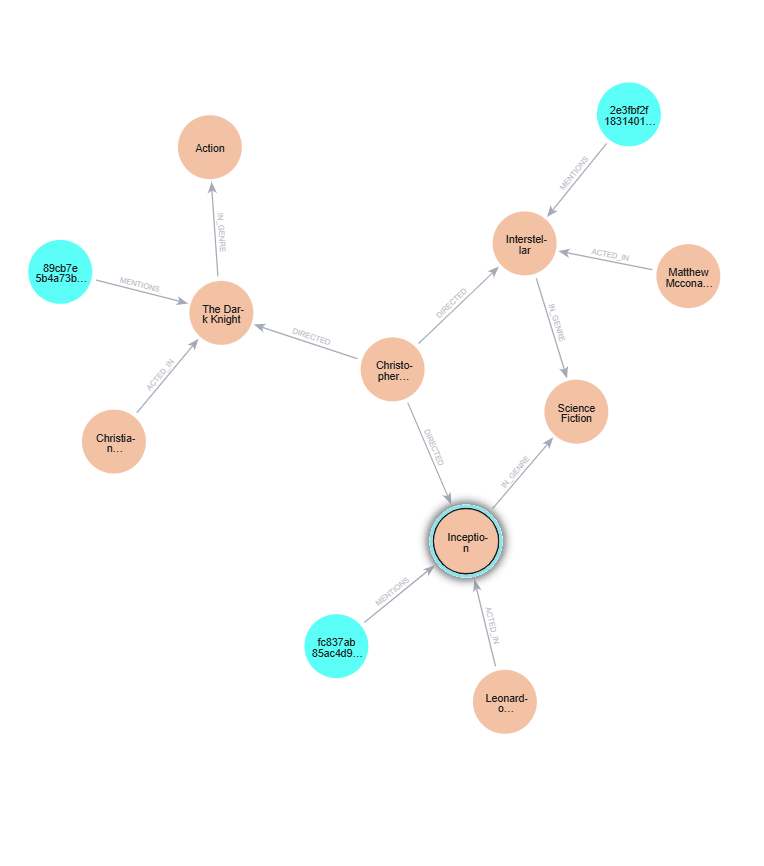

# GraphRAG with Neo4j

## Visualization Diagram




How to build a GraphRAG pipeline with LangChain, Neo4j, and Groq. The notebook follows this flow:

```text
Documents -> Chunking -> Graph extraction -> Neo4j storage
          -> Graph retrieval -> LLM-generated answer
```

## Project Files

- `Graph_RAG_Neo4j.ipynb` - Complete Python walkthrough of the GraphRAG pipeline.
- `Cypher-Query.md` - Cypher commands for creating the example people, movies, and relationships.
- `GraphRAG_Neo4j.pdf` - PDF reference material for the project.

## Prerequisites

- Python 3.9 or newer
- A Neo4j database, such as Neo4j Aura
- A Groq API key
- Jupyter Notebook support in VS Code or another Jupyter environment

## Installation

Install the Python packages used by the notebook:

```bash
pip install --upgrade langchain langchain-community langchain-experimental langchain-groq langchain-neo4j neo4j langchain-text-splitters
```

## Configuration

Open `Graph_RAG_Neo4j.ipynb` and replace the placeholder values in the Neo4j and Groq configuration cells:

```python
NEO4J_URI = "your_neo4j_connection_string"
NEO4J_USERNAME = "your_username"
NEO4J_PASSWORD = "your_password"
NEO4J_DATABASE = "your_database"

groq_api_key = "your_groq_api_key"
```

Do not commit real passwords or API keys. For shared or production work, load these values from environment variables or a secret manager.

## Run the Notebook

1. Open `Graph_RAG_Neo4j.ipynb`.
2. Select a Python kernel with the dependencies installed.
3. Run the cells from top to bottom.
4. Confirm the Neo4j connection succeeds.
5. Review the extracted nodes and relationships before storing them.
6. Try the example questions at the end of the notebook, such as:

```text
Which movies did Christopher Nolan direct?
Who acted in Inception?
Which movie did Christopher Nolan direct in 2010 and who acted in it?
```

The notebook creates a small movie dataset containing `Person`, `Movie`, and `Genre` nodes with `DIRECTED`, `ACTED_IN`, and `IN_GENRE` relationships.

## Cypher Example

`Cypher-Query.md` contains a smaller manually created graph for Inception and Interstellar. Run those statements in Neo4j Browser if you want to inspect the basic graph model directly.

The notebook creates its own graph documents, so running the Cypher file first is optional. If both are used against the same database, duplicate or overlapping data may be created.

## How It Works

1. Movie text is represented as LangChain `Document` objects.
2. Documents are split into smaller chunks.
3. `LLMGraphTransformer` extracts entities and relationships.
4. Extracted graph documents are written to Neo4j.
5. Neo4j relationships are queried directly for connected facts.
6. `GraphCypherQAChain` converts natural-language questions into Cypher and asks the LLM to formulate the final answer.

## Notes

The example uses the Groq model configured in the notebook. Model availability and provider settings can change, so update the model name if the configured deployment is unavailable.
